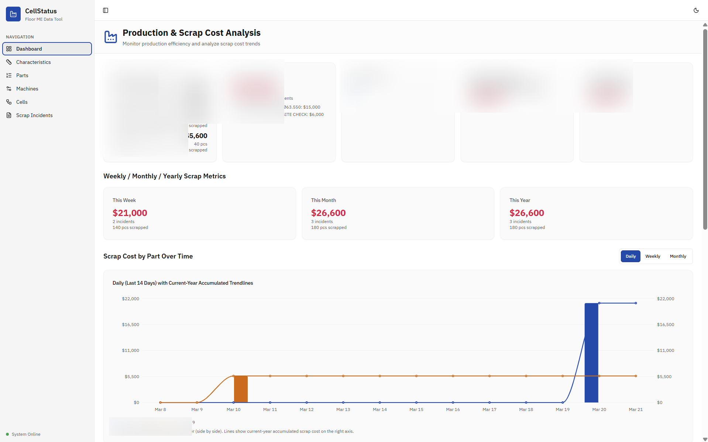
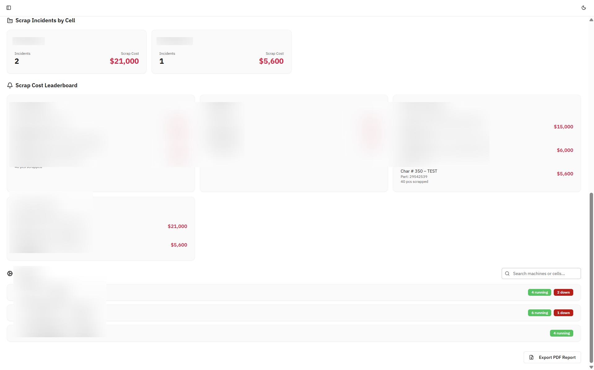
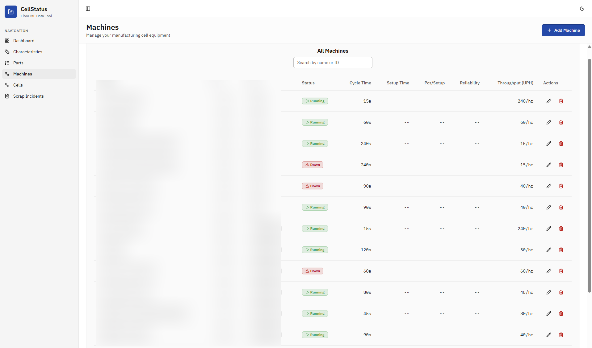
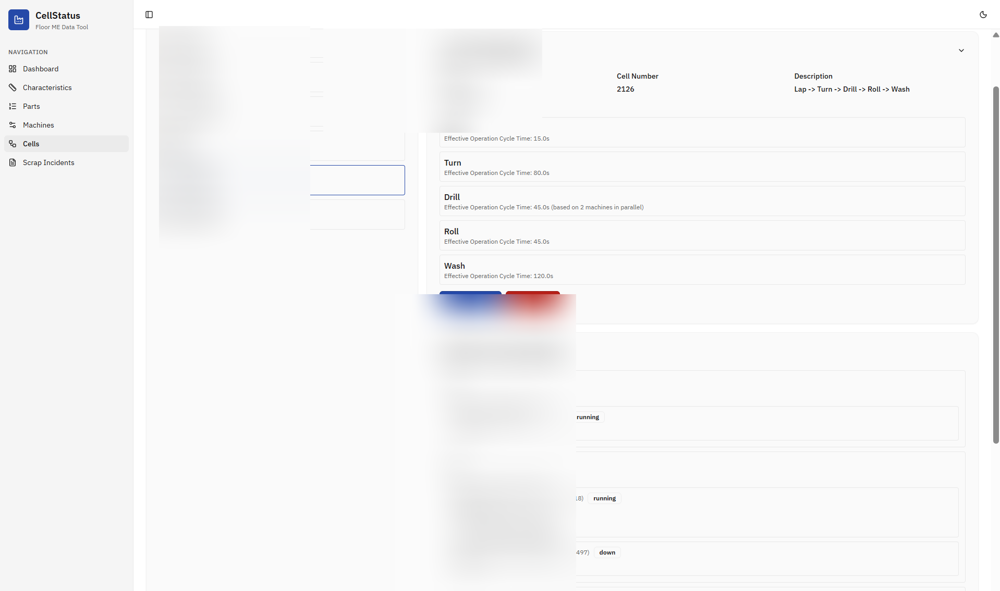
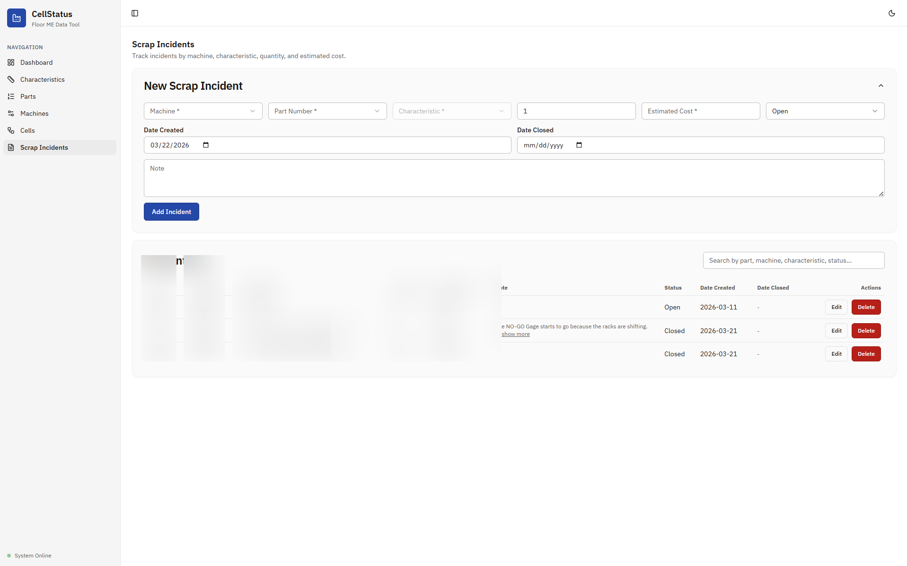
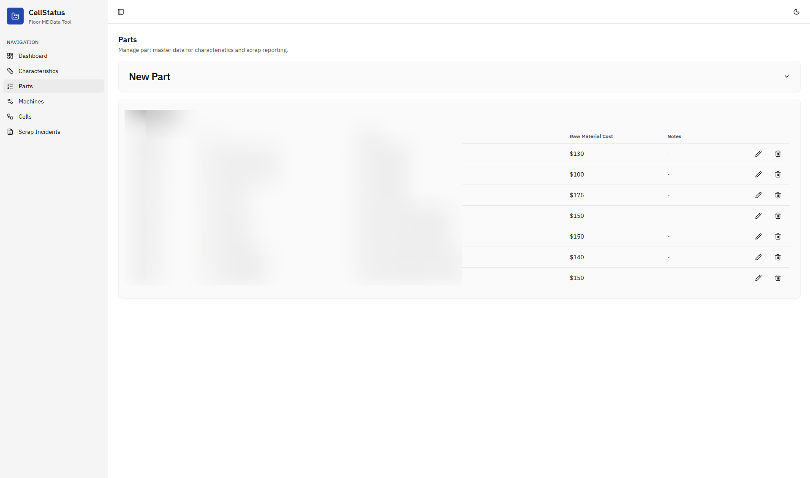
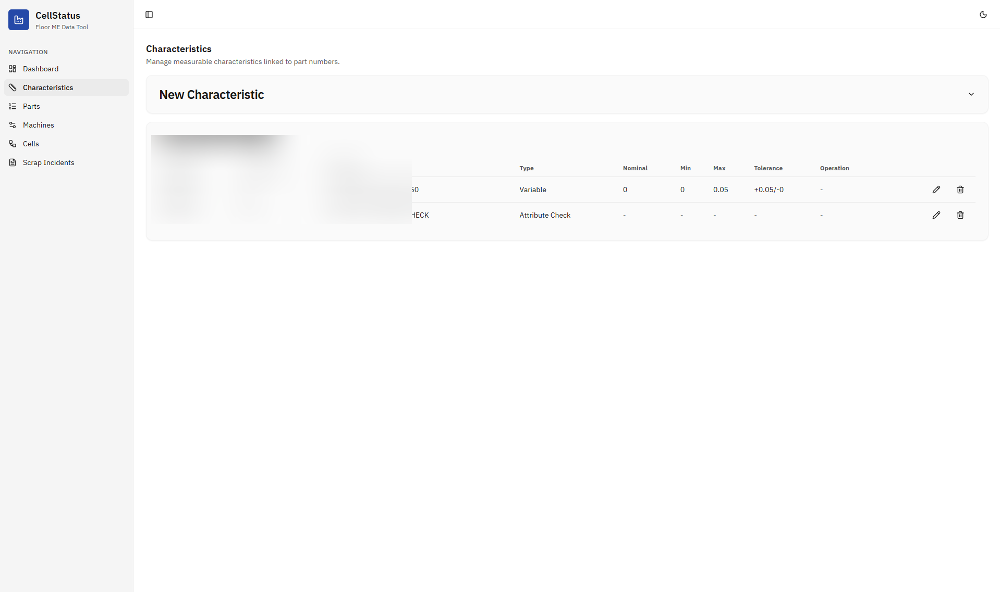

# Production & Scrap Cost Analysis Dashboard

A manufacturing analytics platform for tracking machine status, organizing production cells, managing part and characteristic masters, and analyzing scrap costs and production efficiency.

## Screenshots

### Dashboard Overview

### Scrap Analytics Charts

### Machines Page

### Cells Configuration

### Scrap Incidents

### Parts Master

### Characteristics Master

---

## User Manual

### Navigation

The sidebar provides access to all sections of the application:

| Section | Description |
|---------|-------------|
| **Dashboard** | Production overview, scrap analytics, machine status controls, and trend charts |
| **Characteristics** | Define measurable characteristics (dimensions, tolerances) linked to parts |
| **Parts** | Manage part master data (part numbers, materials, costs) |
| **Machines** | Configure manufacturing equipment with cycle times and reliability |
| **Cells** | Design production cells by assigning machines to operations |
| **Scrap Incidents** | Log and track scrap events with cost, quantity, and root cause data |

---

### Dashboard

The Dashboard is the main hub, combining machine status monitoring with scrap cost analytics.

#### Summary Cards

The top row displays key metrics at a glance:

- **Costliest Scrap Incidents** — Top 3 most expensive incidents. Click any row to jump to its detail in Scrap Incidents.
- **Highest Scrap Machine** — The machine with the most scrap cost.
- **Highest Scrap Cell** — The production cell with the most scrap cost.
- **Time-Range Metrics** — Scrap cost, quantity, and incident count summarized by week, month, and year.
- **Configuration Status** — Number of configured production cells.

#### Scrap Cost Trend Chart

A composite chart showing scrap cost trends for the top 5 parts by cost, with all remaining parts grouped as "Other Parts."

- **Bars** display cost per period (side-by-side, color-coded by part).
- **Lines** show YTD cumulative cost on a separate right-side axis.
- **Granularity selector** — Switch between:
  - **Day** (last 14 days, default)
  - **Weekly** (last 12 weeks)
  - **Monthly** (last 12 months)

#### Machines by Cell

Below the chart, machines are grouped by their assigned production cell. Each machine card shows:

- Machine name, ID, and current status badge
- Cycle time, reliability %, and batch size (if configured)
- Scrap incident count (click to view incidents for that machine)
- **Status buttons** — Change machine status directly: Running, Idle, Setup, Maintenance, or Down
- **Status note** — Add or edit a note via the card's dropdown menu (⋯)
- **Edit/Delete** — Modify or remove the machine from the dropdown menu

Cells are sorted numerically first (Cell 1, Cell 2, Cell 10), then alphabetically. Machines within each cell are sorted by machine ID.

#### PDF Export

Click the export button to generate a PDF report containing the current dashboard data, including the scrap cost trend chart at the selected granularity.

---

### Parts

The Parts page manages the part master — the catalog of manufactured parts.

#### Adding a Part

1. Click **Add Part** to expand the form.
2. Fill in the fields:
   - **Part Number** (required) — Unique identifier
   - **Part Name** — Descriptive name
   - **Material** — Material type
   - **Raw Material Cost** — Cost per unit (used for scrap cost calculations)
   - **Notes** — Any additional information
3. Click **Add Part** to save.

#### Editing and Deleting

- Click the **Edit** button on any row to load the part into the form for editing.
- Click **Delete** to remove a part.

> **Note:** Raw Material Cost is used by the cost calculator in Scrap Incidents. If a part has a material cost set, the calculator button will auto-fill estimated cost = material cost × quantity.

---

### Characteristics

Characteristics define the measurable dimensions or attributes inspected during production. Each characteristic is linked to a specific part.

#### Adding a Characteristic

1. Expand the **New Characteristic** form.
2. Select a **Part Number** (the part name is shown alongside the number).
3. Enter a **Characteristic Number** and optional **Characteristic Name**.
4. Choose the measurement type:
   - **Variable (dimensional)** — Requires nominal value and tolerance
   - **Attribute (non-dimensional)** — Check the "Attribute Check" box to skip numeric fields
5. For variable characteristics, configure:
   - **Nominal Value** — Target dimension
   - **Tolerance Type** — Bilateral (±) or Unilateral (one-sided)
   - **Tolerance Value** — Allowable deviation
   - If unilateral, select the **Direction** (upper or lower)
6. The **Min**, **Max**, and **Tolerance** fields are computed automatically.
7. Click **Add Characteristic** to save.

#### Tolerance Types Explained

| Type | Description | Example (Nominal = 10, Tolerance = 0.5) |
|------|-------------|------------------------------------------|
| **Bilateral** | Equal deviation in both directions (±) | Min: 9.5, Max: 10.5 |
| **Unilateral Upper** | Deviation only above nominal (+tol / -0) | Min: 10.0, Max: 10.5 |
| **Unilateral Lower** | Deviation only below nominal (+0 / -tol) | Min: 9.5, Max: 10.0 |

---

### Machines

The Machines page lists all manufacturing equipment in a sortable table.

#### Table Columns

| Column | Description |
|--------|-------------|
| Name | Machine display name |
| Machine ID | Unique identifier (shown as badge) |
| Cell | Assigned production cell (if any) |
| Status | Current state: Running, Idle, Setup, Maintenance, or Down |
| Cycle Time | Seconds per part |
| Setup Time | Seconds to set up between runs |
| Pcs/Setup | Parts produced per setup (batch size) |
| Reliability % | Uptime percentage (0–100) |
| Throughput (UPH) | Calculated units per hour based on cycle time, setup time, batch size, and reliability |

#### Throughput Calculation

UPH (Units Per Hour) is calculated as:

$$\text{UPH} = \frac{3600}{\text{Cycle Time} + \frac{\text{Setup Time}}{\text{Batch Size}}} \times \frac{\text{Reliability}}{100}$$

If batch size is not set, setup time is applied per unit.

#### Adding a Machine

Click **Add Machine** and fill in:
- **Name** and **Machine ID** (both required)
- **Cell** (optional — or assign later via Cells page)
- **Status** (default: Idle)
- **Cell Data** (optional): Cycle Time, Setup Time, Pcs/Setup, Reliability %

#### Search

Use the search bar to filter machines by name or machine ID.

---

### Cells

Cells represent production lines or work areas. Each cell contains one or more **operations**, and each operation has one or more **machines** assigned to it.

#### Creating a Cell

1. Click **+ New Cell** in the left panel.
2. Enter a **Cell Name**, **Cell Number**, and optional **Description**.
3. Click **Add Operation** to define the manufacturing steps.
4. For each operation:
   - Enter an **Operation Name**
   - Select machines from the dropdown and click **Add** to assign them
5. Click **Save** to create the cell.

#### Cell Metrics

When a cell is selected, the summary cards show:

- **Machines** — Total machines assigned across all operations
- **Scrap Incidents** — Total incidents (and count of open ones)
- **Total Scrap Cost** — Sum of all incident costs for machines in this cell
- **Bottleneck** — The slowest operation, with its effective cycle time and resulting UPH

#### Operation Cycle Time Calculation

When multiple machines are assigned to an operation, they run **in parallel**. The effective cycle time is:

$$\text{Effective Cycle Time} = \frac{\text{Slowest Machine Cycle Time}}{\text{Number of Machines}}$$

The bottleneck operation (highest effective cycle time) determines the cell's overall throughput.

#### Cell List

The cell list in the left panel is collapsible. Cells are sorted by cell number (numeric first), then alphabetically by name.

---

### Scrap Incidents

The Scrap Incidents page logs quality defects and scrap events for tracking and analysis.

#### Creating an Incident

1. Expand the **New Scrap Incident** form.
2. Select a **Machine** from the dropdown.
3. Select a **Part Number** — the characteristic dropdown filters to show only characteristics linked to that part.
4. Select a **Characteristic** that was out of spec.
5. Enter the **Quantity** scrapped.
6. Enter the **Estimated Cost**, or click the **calculator button** (🧮) to auto-calculate using:

$$\text{Estimated Cost} = \text{Raw Material Cost} \times \text{Quantity}$$

   The calculator only appears when the selected part has a Raw Material Cost configured.

7. Set the **Status** (Open or Closed) and optionally fill in dates and notes.
8. Click **Add Incident** to save.

#### Filtering and Search

- **Search bar** — Filter incidents by part number, machine, characteristic, or status.
- **URL filters** — The page supports pre-filtering via URL parameters (`?machineId=`, `?cell=`, `?char=`). Clicking machine scrap counts on the Dashboard uses this to jump directly to relevant incidents.
- **Clear Filters** — Click the button in the header to remove active filters.

#### Editing

Click any incident row to select it, then use the **Edit** button to modify its fields. Changes are saved immediately.

---

## Tech Stack

- **Frontend:** React + TypeScript + Vite + Wouter + TanStack Query
- **UI:** Tailwind CSS + shadcn/ui
- **Backend:** Express + TypeScript
- **Database:** PostgreSQL (Neon) + Drizzle ORM

## Local Setup

1. Install dependencies
	- `npm install`
2. Configure environment in `.env`
	- `DATABASE_URL`
	- `API_PASSWORD`
3. Sync schema
	- `npm run db:push`
4. Start app
	- `npm run dev`

## Scripts

- `npm run dev` — Start full-stack dev server
- `npm run check` — Type-check project
- `npm run db:push` — Push Drizzle schema changes
- `npm run build` — Build production bundle

## License

MIT

